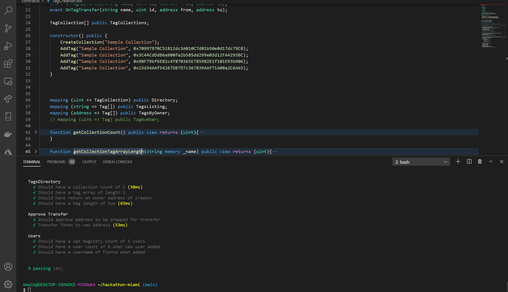

# hackathon-miami
Miami Jan 2021 Hackathon
## User Story

I used to spend a lot of spare time playing Disc Golf and Regular Golf. Within the community there type of competition called playing for tags. A Tag is a marker with a number designation usually kept on the golfer when they are playing a round. The tag is a member of a set of tags ranging from 10 to 50 tags. They are each numbered respectively with 1 being the coveted tag. A golfer can only have one tag number of a set.

When two or more golfers are playing for tags, who ever wins the round, gets the lowest number tag. This type of competition gives golfer an achievement style game as they can collect multiple sets, playing for the lowest possible tag number of that set.

Sometimes it can become an issue of getting that lowest number tag as possible because of human error. Golfers either lose their own tag or don't know which golfer has which certain tag. That is where Blockchain technology comes in to save the day! Golfers are able to see who has which tag number in a set and are also able to keep a digital copy of their own tag for Trades. Tags can not be stolen from other members.

## Progress

   ### Done
   I got all the contracts created in my project. There are two. One is for the users so that they can enter a username for the website so it is easier to display tag ownership information within the community. The other contract is for the Tag Directory that lets you create a new collection of tags which automaticallys gives tag number 1 to the creator. It always for other users to add a tag onto that collection to begin your "playing for tags". All Transfers must be approved by both parties for the trade. While is set-up for both parties to be able to initiate the transfer, it should be on the person who is receiving the lower tag if not already owned. 

   ### Need to Do
   - I ran out of time for the Front End of this project.
   -  In my head, I was imagining a home page with the list of the tag collection names in a navigation bar to the left. 
   - In the right main view, button options to Create a new Collection of Tags, quick approval and transfer buttons, and documentation about what a tag is and how to play. 
   - When a user clicks on a tag name on the left, they are directed to a view with all the current tags in the collection and the current owner of each tag. 
   - There will be a Button at the top to add a new tag to the collection to start playing.
   - There will also be a transfer button on the page for quick navigation
## Future
 - I spent a lot of consideration for making this project in React Native as I think it would benefit the user greatly if there were able to transfer their tags immediately after their round. 
 - A physical tag is fun to have because of the artwork that is implied with the tag. I want to set up for the user to add a type of artwork for their tag image. So the tags on the collection page will be displayed in a card with the artwork as the background. 
## Visual Progress
  
